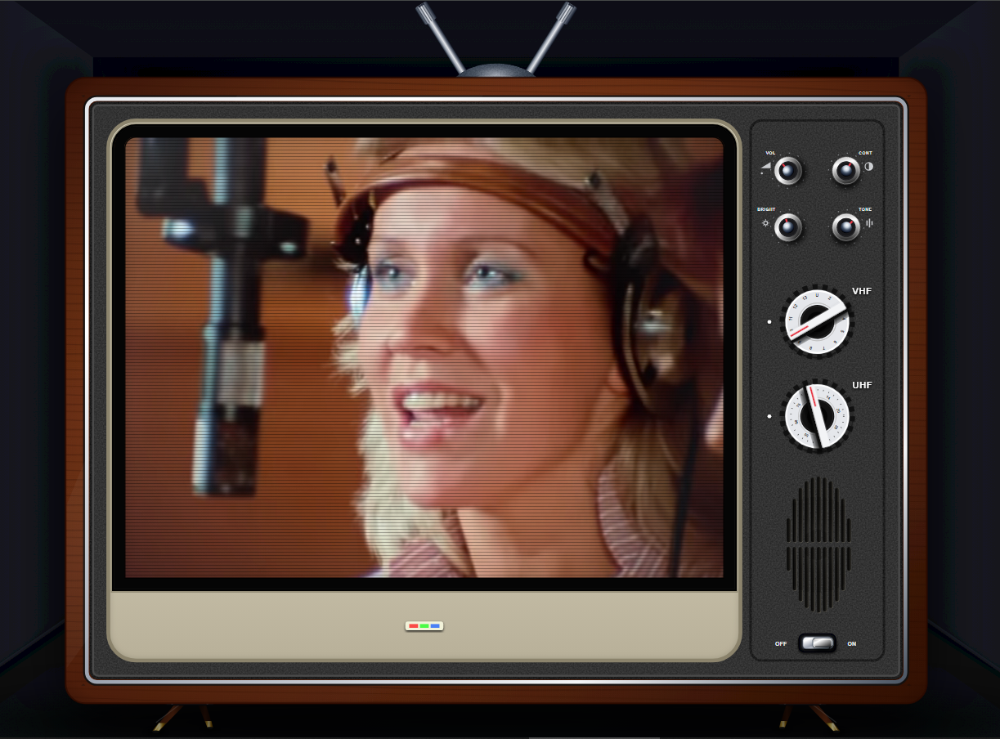

# Retro TV - YouTube Player

An immersive, dynamic SVG-based Retro TV interface for watching YouTube videos with styled CRT aesthetics and adaptive aspect ratio scaling.

## Overview

Retro TV transforms any standard YouTube video into a nostalgic 80s television experience. Built purely with Vanilla JS and SVG, it automatically detects video dimensions to dynamically scale the TV casing, CRT screen mask, and control panel while preserving authentic visual ratios.

## Quick Usage & URL Trick

You can easily load any YouTube video by replacing `youtube.com` with `tvretro.github.io` directly in your browser's address bar:

* **Original YouTube URL:**
  `https://www.youtube.com/watch?v=XEjLoHdbVeE`
* **Retro TV URL:**
  `https://tvretro.github.io/watch?v=XEjLoHdbVeE`

*Note: You can also use the short URL format directly: `https://tvretro.github.io/XEjLoHdbVeE`*
